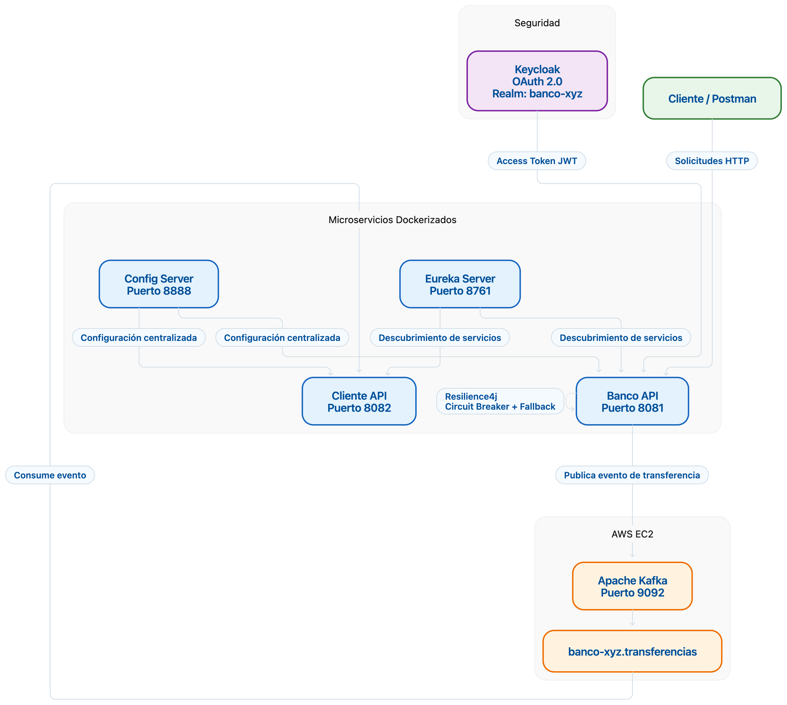

# Proyecto Backend III - Exp3_S8_Grupo2

## 1. Descripción del proyecto

Este proyecto corresponde a la implementación de una arquitectura de microservicios para el sistema Banco XYZ, incorporando mecanismos de seguridad, comunicación asíncrona y tolerancia a fallos.

La solución integra los siguientes componentes:

* Banco API
* Cliente API
* Eureka Server
* Config Server
* Apache Kafka
* Keycloak
* OAuth 2.0
* Resilience4j
* Docker y Docker Compose

La comunicación asíncrona entre Banco API y Cliente API se realiza mediante Apache Kafka, utilizando el tópico `banco-xyz.transferencias`.

La autenticación de los endpoints protegidos se implementa mediante Keycloak y OAuth 2.0 utilizando tokens JWT.

---

## 2. Arquitectura de la solución

La solución utiliza una arquitectura de microservicios donde cada componente cumple una función específica.

* **Banco API:** administra las operaciones relacionadas con el banco y publica eventos de transferencias.
* **Cliente API:** consume los eventos publicados por Banco API mediante Kafka.
* **Eureka Server:** permite el registro y descubrimiento de los microservicios.
* **Config Server:** centraliza la configuración de los servicios.
* **Keycloak:** administra la autenticación mediante OAuth 2.0 y emisión de tokens JWT.
* **Apache Kafka:** permite la comunicación asíncrona entre Banco API y Cliente API.
* **Resilience4j:** proporciona mecanismos de tolerancia a fallos mediante Circuit Breaker y lógica de fallback.
* **Docker:** permite ejecutar los componentes mediante contenedores.
* **AWS EC2:** se utiliza para ejecutar el componente Kafka mediante Docker Compose, de acuerdo con el requerimiento de la actividad.

### Diagrama de arquitectura



---

## 3. Arquitectura orientada a eventos

Se implementa una Arquitectura Orientada a Eventos (EDA) utilizando el patrón de Publicación-Suscripción (Pub/Sub).

El flujo principal de eventos es el siguiente:

1. El cliente realiza una operación de transferencia en Banco API.
2. Banco API genera un evento `TRANSFERENCIA_REALIZADA`.
3. El evento se estructura en formato JSON.
4. Banco API publica el evento en Apache Kafka.
5. El mensaje es enviado al tópico `banco-xyz.transferencias`.
6. El tópico cuenta con 3 particiones para distribuir los mensajes.
7. Cliente API se encuentra suscrito al tópico.
8. Cliente API consume el evento de forma asíncrona y procesa la información recibida.

Este enfoque permite desacoplar los servicios y evita que Banco API dependa directamente de la disponibilidad inmediata de Cliente API para completar la publicación del evento.

---

## 4. Componentes del sistema

### 4.1 Banco API

Microservicio encargado de las operaciones bancarias.

Puerto:

```text
8081
```

Entre sus funcionalidades se encuentran:

* Endpoint de salud.
* Endpoints protegidos mediante OAuth 2.0.
* Operaciones de transferencia.
* Publicación de eventos hacia Kafka.
* Integración con Eureka.
* Integración con Config Server.
* Tolerancia a fallos mediante Resilience4j.

---

### 4.2 Cliente API

Microservicio encargado de consumir y procesar los eventos enviados por Banco API.

Puerto:

```text
8082
```

El servicio utiliza un consumidor Kafka asociado al tópico:

```text
banco-xyz.transferencias
```

El consumidor procesa los eventos de manera asíncrona.

---

### 4.3 Eureka Server

Servidor de descubrimiento de servicios utilizado para registrar los microservicios.

Puerto:

```text
8761
```

Permite verificar el registro y estado de los servicios dentro del ecosistema de microservicios.

---

### 4.4 Config Server

Servidor encargado de centralizar la configuración de los microservicios.

Puerto:

```text
8888
```

La configuración se obtiene desde el repositorio de configuración ubicado en:

```text
Exp2_S6_Config_Server/config-repo/
```

---

### 4.5 Keycloak y OAuth 2.0

Keycloak se utiliza como servidor de autenticación y autorización.

Realm utilizado:

```text
banco-xyz
```

Cliente configurado:

```text
banco-api
```

El Banco API funciona como un Resource Server y valida los Access Token JWT emitidos por Keycloak.

El endpoint protegido rechaza solicitudes sin autenticación y permite el acceso cuando se presenta un token válido.

Flujo simplificado:

```text
Cliente
   ↓
Keycloak
   ↓
Access Token JWT
   ↓
Banco API
   ↓
Acceso autorizado
```

---

## 6. Apache Kafka

Apache Kafka se utiliza como broker de mensajería para implementar la comunicación asíncrona entre Banco API y Cliente API.

Puerto:

```text
9092
```

Tópico utilizado:

```text
banco-xyz.transferencias
```

El tópico cuenta con:

```text
3 particiones
```

El productor corresponde a:

```text
Banco API
```

El consumidor corresponde a:

```text
Cliente API
```

Evento utilizado:

```text
TRANSFERENCIA_REALIZADA
```

Flujo:

```text
Banco API
    │
    │ Publica evento
    ▼
Kafka
    │
    │ banco-xyz.transferencias
    ▼
Cliente API
    │
    │ Consume evento
    ▼
Procesamiento asíncrono
```

---

## 7. Kafka en AWS EC2

De acuerdo con los requerimientos de la actividad, Apache Kafka se despliega mediante Docker Compose en una instancia AWS EC2.

El componente Kafka utiliza Docker para facilitar su ejecución y administración.

La arquitectura contempla:

```text
AWS EC2
   │
   └── Docker
         │
         └── Apache Kafka
                │
                └── banco-xyz.transferencias
```

Los demás microservicios pueden ejecutarse de manera independiente, manteniendo la comunicación con Kafka mediante la configuración correspondiente.

---

## 8. Resilience4j

Se utiliza Resilience4j para implementar mecanismos de tolerancia a fallos.

El sistema incorpora:

* Circuit Breaker.
* Fallback.
* Manejo de fallos en servicios.
* Protección frente a interrupciones temporales.

El objetivo es evitar que una falla temporal de un servicio provoque la caída completa del sistema.

El flujo general es:

```text
Solicitud
    │
    ▼
Banco API
    │
    ▼
Circuit Breaker
    │
    ├── Servicio disponible → respuesta normal
    │
    └── Servicio con falla → Fallback
```

---

## 9. Docker

Los microservicios fueron preparados para ejecutarse mediante imágenes Docker.

Se utilizan Dockerfiles para:

* Banco API
* Cliente API
* Config Server
* Eureka Server

Las imágenes utilizan Java 17 como base de ejecución.

Ejemplo de estructura:

```text
FROM eclipse-temurin:17-jdk
WORKDIR /app
COPY target/*.jar app.jar
ENTRYPOINT ["java", "-jar", "app.jar"]
```

---

## 10. Docker Compose

Docker Compose permite levantar los principales microservicios de manera coordinada.

Los servicios definidos para la ejecución local son:

```text
eureka-server
config-server
banco-api
cliente-api
```

Kafka se integra mediante la red Docker utilizada por los servicios.

Para levantar los microservicios:

```bash
docker compose up -d --build
```

Para verificar los contenedores:

```bash
docker ps
```

Para detener los servicios:

```bash
docker compose down
```

---

## 11. Configuración de puertos

| Componente    | Puerto |
| ------------- | -----: |
| Keycloak      |   8080 |
| Banco API     |   8081 |
| Cliente API   |   8082 |
| Config Server |   8888 |
| Eureka Server |   8761 |
| Kafka         |   9092 |

---

## 12. Flujo completo del sistema

El funcionamiento general de la solución puede resumirse de la siguiente manera:

```text
                 ┌──────────────────┐
                 │    Keycloak      │
                 │    OAuth 2.0     │
                 └────────┬─────────┘
                          │
                    Access Token
                          │
                          ▼
┌──────────────┐    ┌──────────────┐
│   Cliente    │───►│  Banco API   │
│   / Postman  │    │    :8081     │
└──────────────┘    └──────┬───────┘
                           │
                    Evento de
                    transferencia
                           │
                           ▼
                    ┌────────────┐
                    │   Kafka    │
                    │    :9092   │
                    │  AWS EC2   │
                    └─────┬──────┘
                          │
              banco-xyz.transferencias
                          │
                          ▼
                  ┌──────────────┐
                  │ Cliente API  │
                  │    :8082     │
                  └──────────────┘
```

Eureka Server permite el descubrimiento de los servicios y Config Server centraliza la configuración.

Resilience4j agrega mecanismos de Circuit Breaker y fallback para mejorar la tolerancia a fallos.

---

## 13. Ejecución del proyecto

### 13.1 Requisitos

Para ejecutar el proyecto se requiere:

* Java 17
* Maven
* Docker
* Docker Compose
* Git
* Keycloak
* Apache Kafka
* AWS EC2 para el despliegue de Kafka

---

### 13.2 Compilación de los microservicios

Desde cada proyecto se puede generar el archivo JAR mediante:

```bash
mvn clean package -DskipTests
```

Los archivos JAR generados son utilizados posteriormente por los Dockerfiles.

---

### 13.3 Ejecución mediante Docker Compose

Ubicarse en la carpeta principal del proyecto:

```bash
cd Exp3_S8_Grupo2_
```

Ejecutar:

```bash
docker compose up -d --build
```

Verificar los contenedores:

```bash
docker ps
```

---

## 14. Validación de OAuth 2.0

Para obtener un Access Token desde Keycloak se utiliza el endpoint:

```text
http://localhost:8080/realms/banco-xyz/protocol/openid-connect/token
```

El flujo utiliza:

```text
grant_type=client_credentials
client_id=banco-api
client_secret=<secret>
```

Posteriormente, el Access Token se utiliza como Bearer Token para acceder a los endpoints protegidos de Banco API.

Sin token:

```text
HTTP 401 Unauthorized
```

Con un token válido:

```text
HTTP 200 OK
```

Esto demuestra que el endpoint protegido requiere autenticación mediante OAuth 2.0.

---

## 15. Evidencias

La carpeta `evidencias` contiene las capturas correspondientes a las pruebas realizadas durante la implementación.

Entre las evidencias se incluyen:

* Ejecución de los contenedores Docker.
* Construcción de las imágenes Docker.
* Registro de los servicios en Eureka.
* Funcionamiento de Kafka.
* Tópico `banco-xyz.transferencias`.
* Publicación y consumo de eventos.
* Funcionamiento de Resilience4j.
* Protección de endpoints mediante OAuth 2.0.
* Acceso autorizado mediante Access Token.
* Diagrama de arquitectura.
* Ejecución de los componentes necesarios para la solución.

---

## 16. Resultado

La implementación permite integrar diferentes mecanismos de una arquitectura de microservicios moderna:

* **OAuth 2.0 y Keycloak** para autenticación.
* **Docker** para contenerización.
* **Docker Compose** para orquestación.
* **Eureka Server** para descubrimiento de servicios.
* **Config Server** para configuración centralizada.
* **Apache Kafka** para comunicación asíncrona.
* **Resilience4j** para tolerancia a fallos.
* **AWS EC2** para la ejecución de Kafka en la nube.

Con esto se obtiene una solución desacoplada, segura y preparada para escenarios de comunicación asíncrona y tolerancia a fallos.
